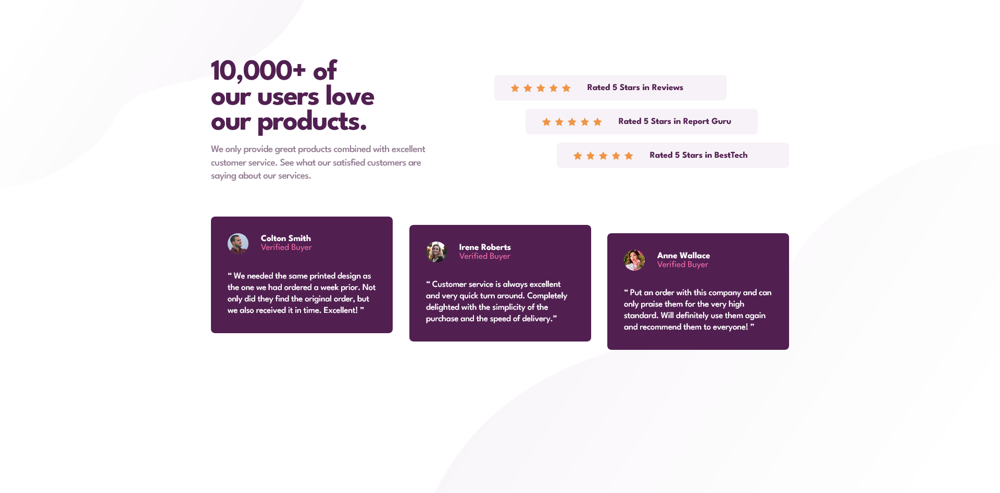

# Frontend Mentor - Social proof section solution

This is a solution to the [Social proof section challenge on Frontend Mentor](https://www.frontendmentor.io/challenges/social-proof-section-6e0qTv_bA). Frontend Mentor challenges help you improve your coding skills by building realistic projects. 

## Table of contents

- [Overview](#overview)
  - [The challenge](#the-challenge)
  - [Screenshot](#screenshot)
  - [Links](#links)
- [My process](#my-process)
  - [Built with](#built-with)
  - [What I learned](#what-i-learned)
- [Author](#author)

**Note: Delete this note and update the table of contents based on what sections you keep.**

## Overview

This is a project where it gives you an opportunity to practice building layouts using CSS Flexbox and Grid.

### The challenge

Users should be able to:

- View the optimal layout for the section depending on their device's screen size

### Screenshot



### Links

- Solution URL: [https://www.frontendmentor.io/solutions/responsive-social-proof-section-using-css-flexbox-and-grid-UNhDkAGWef](https://www.frontendmentor.io/solutions/responsive-social-proof-section-using-css-flexbox-and-grid-UNhDkAGWef)
- Live Site URL: [https://schindlerdumagat.github.io/social-proof-section/](https://schindlerdumagat.github.io/social-proof-section/)

## My process

1. Create a Github repository for the project.
2. Check the design, typography, colors, spacings and other things in the Figma file provided.
3. Structure my HTML based on the design.
4. Import the necessary font from the google fonts website, create CSS resets, custom variables, base styles and style the HTML elements.
5. Polish the overall solution and check the similarities of the solution from the design provided together with its responsiveness.
6. Publish the solution in Github and create a live site.
7. Check the live site to make sure it works properly.

### Built with

- Semantic HTML5 markup
- CSS custom properties
- Flexbox
- CSS Grid
- Mobile-first workflow
- [BEM](https://getbem.com/) - Block, Element, Modifier

### What I learned

I was able to create a background with two images. I learned some css properties that are related to background which I have used in the code below.
```css
body {
  font-family: var(--ff-main);
  font-size: var(--fs-body);
  color: var(--clr-purple-300);
  background-color: var(--clr-white);
  background-image: url("./images/bg-pattern-top-mobile.svg"),
                    url("./images/bg-pattern-bottom-mobile.svg");
  background-repeat: no-repeat, no-repeat;
  background-position: top left, bottom right;
  background-size: auto, contain;
  padding-inline: var(--space-300);
  padding-block: clamp(var(--space-1000), 2.8531rem + 9.1603vw, var(--space-1425));
  display: flex;
  flex-direction: column;
  align-items: center;
}
```

I was able to implement a staggered layout using CSS Flexbox, Grid and transform properties.
```css
.reviews__item:nth-child(1) {
  align-self: flex-start;
}

.reviews__item:nth-child(2) {
  align-self: center;
}
.reviews__item:nth-child(3) {
  align-self: flex-end;
}

.testimonials {
  grid-template-columns: repeat(3, 1fr);
}

.testimonials__card:nth-child(2) {
  transform: translateY(clamp(0rem, -2.4615rem + 3.8462vw, 1rem));
}

.testimonials__card:nth-child(3) {
  transform: translateY(clamp(0rem, -4.9231rem + 7.6923vw, 2rem));
}
```

## Author

- Website - [Schindler Dumagat](https://schindlerdumagat.github.io/webportfolio/)
- Frontend Mentor - [@schindlerdumagat](https://www.frontendmentor.io/profile/schindlerdumagat)
- LinkedIn - [@schindler-dumagat-015238230](https://www.linkedin.com/in/schindler-dumagat-015238230/)
